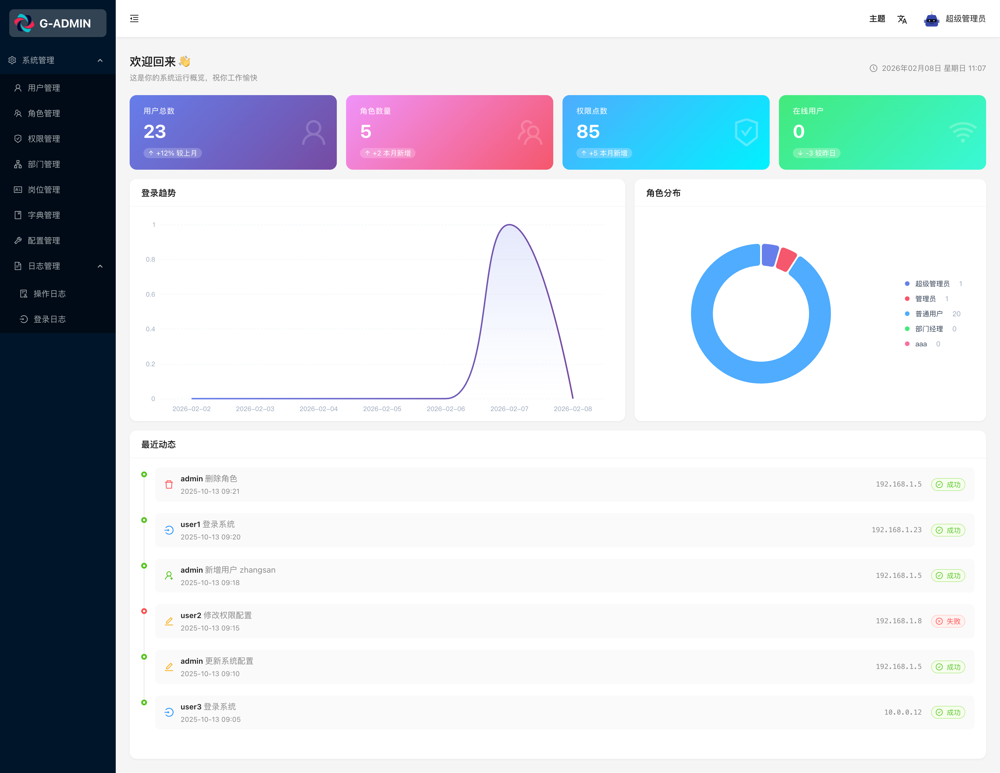
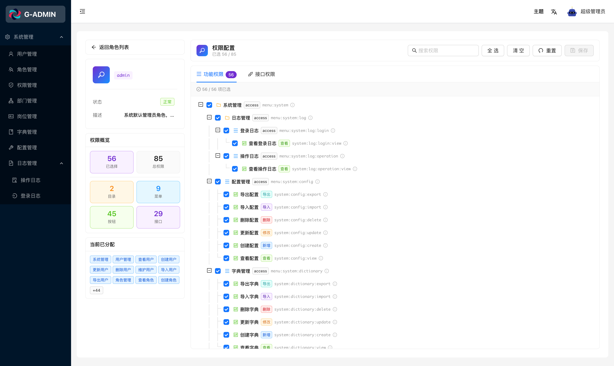
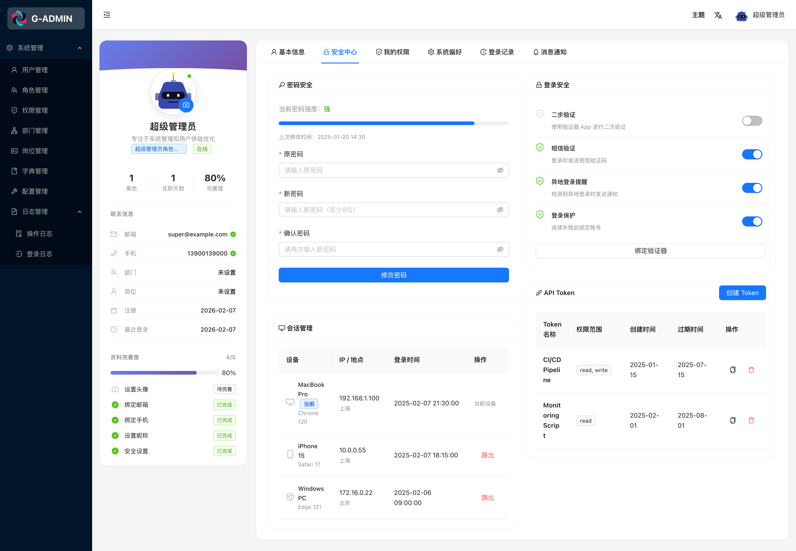
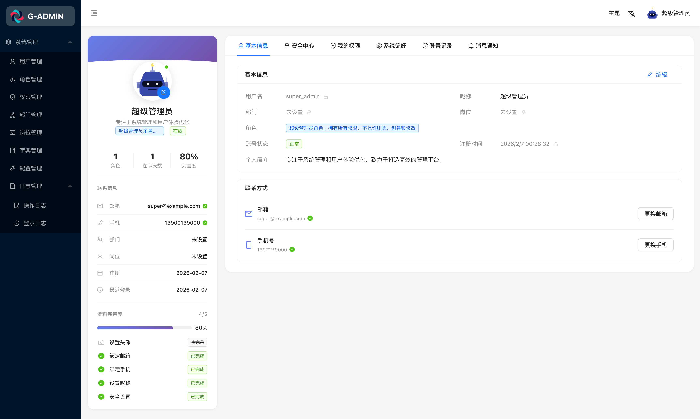
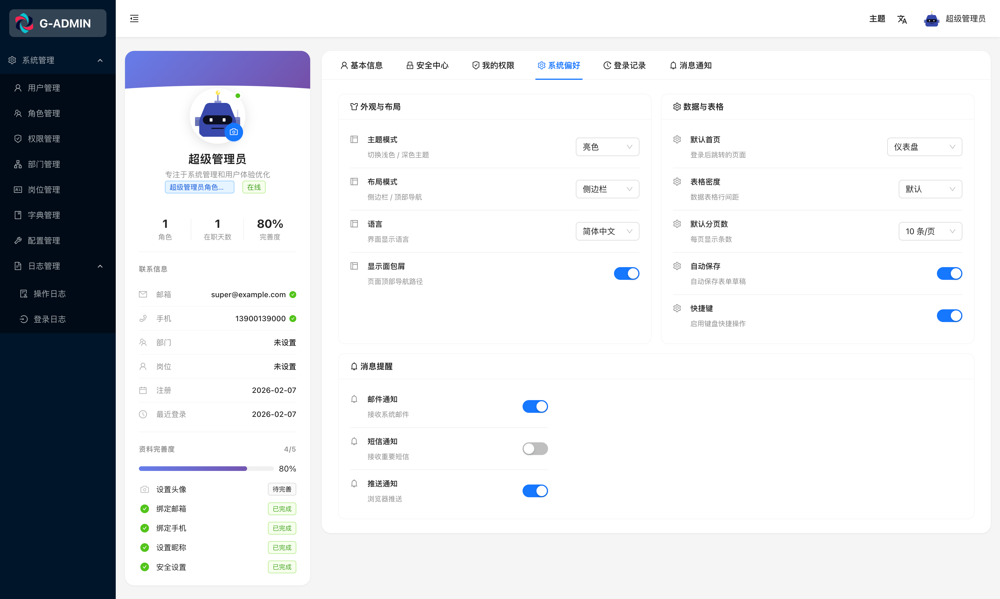
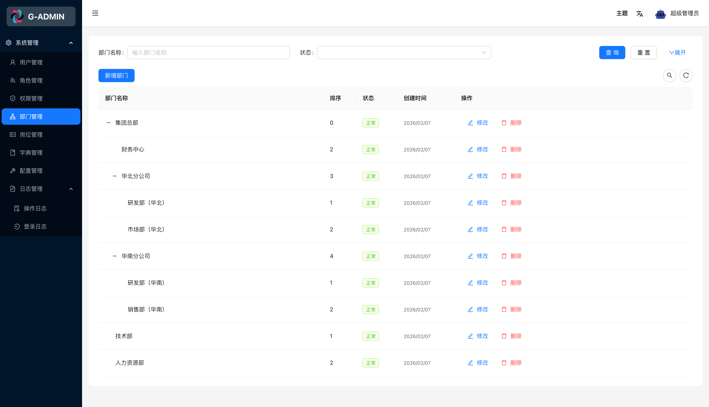
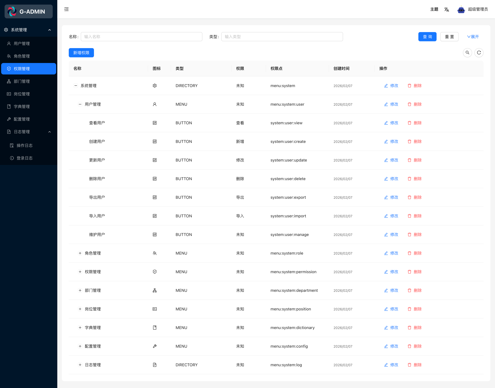
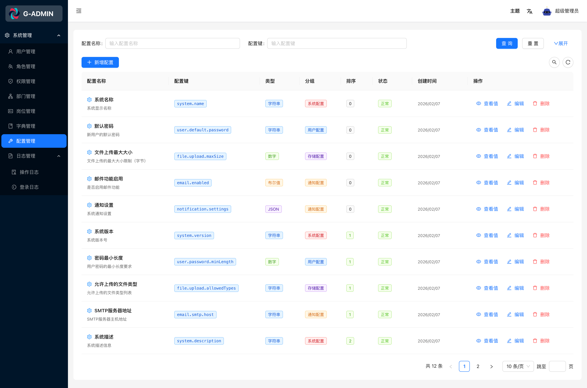

# React Umi Admin — 企业级 RBAC 权限管理系统 & 前端架构解决方案

<!-- keywords: react, umi, ant-design, rbac, admin, dashboard, permission, access-control -->

🦄 基于 React18 + Umi4 + Ant Design5 构建的现代化后台管理系统，专注于**前端架构与技术方案的极致实现**。系统提供完整的 RBAC 权限管理、全局状态管理、动态路由、布局定制、多语言支持、网络请求封装、Mock 数据模拟等核心能力，可直接作为企业级后台系统开发的通用框架。

## 🚀 项目理念

我是多年一线前端架构师，希望通过本项目把个人经验沉淀为企业级中后台前端标准样板。它不仅实现完整 RBAC 权限管理，也融合现代前端最佳实践，追求极致可维护性、可扩展性与复用性。这是一个可复用的前端架构，让复杂业务在稳定、高性能基础上持续演进。前后端同步开发，部分数据仍在持续更新。  
未来规划：全面迁移至 Vite，性能与体验全面升级。  
⭐⭐⭐⭐⭐ 觉得这个项目有价值？点个 Star，支持高可维护、高可复用的前端实践！

## 🔥 项目展示

登陆路径：/login 登陆账号：admin@example/admin/13800138000 登陆密码：admin123

核心页面一览：

    

<details>

<summary>更多页面截图</summary>

        

</details>

## 📚 文档导航

- 👉 [Roadmap](docs/roadmap.md) — 功能开发清单与实现状态
- 👉 [Architecture Documentation](./docs/architecture.md) — 架构设计与实现
- 👉 [UMI 限制分析](docs/UMI_LIMITATIONS.md) — Umi 框架局限性与最佳实践
- 👉 [架构特性](#-架构特性) — 系统运行时能力、平台基础设施、工程化能力
- 👉 [核心功能模块](#-核心功能模块) — 用户、权限、配置、日志等
- 👉 [开发指南](docs/developer-guide.md) — 环境搭建、脚手架、插件机制
- 👉 [API 文档] — OpenAPI 同步接口说明
- 👉 [贡献指南](docs/contributing.md) — 提交规范、PR 流程

## ⚙️ 架构特性（Architecture Capabilities）

### 🧠 应用运行时能力（Runtime Core）

- 自定义 Layout 与动态菜单系统
- 路由系统（支持 keepAlive 与数据加载）
- 用户登录鉴权与权限运行时管理
- 系统异常处理（页面异常 / 请求异常统一处理）
- 全局状态管理（Zustand / Redux Toolkit）
- 主题定制与动态主题管理
- 国际化（多语言）支持（~src/locales）
- 运行时 Mock 数据模拟（~mock 自动加载 / MOCK_ENABLED 控制）
- 网络请求模块（基于 Axios 的请求管线）
- 请求策略统一（重试 / 取消 / 错误标准化）

### 🧱 系统基础设施（Platform Infrastructure

- UI 组件库集成（Ant Design 5.x）
- 样式管理方案（模块化样式 / CSS-in-JS 支持）
- 权限管理体系（菜单 / 按钮 / API）
- 本地开发代理（Proxy）
- 站点统计与基础数据采集
- OpenAPI 类型自动同步
- 微生成器（Umi Generator）提升开发效率
- 开发插件扩展机制
- 微前端架构支持（Qiankun / single-spa）
- 缓存策略（LocalStorage / Session / IndexedDB）

### 🛠️ 工程化与开发体验（DX Engineering

- 多环境构建与变量配置
- 全面支持 TypeScript
- 编码规范与 Git 提交校验
- 工程代码调试方案
- 单元测试 / 集成测试支持
- Mock 自动化加载机制
- 灵活路由与独立布局架构
- 自定义 Hooks 与模块化状态设计
- 打包构建优化（代码分割 / 懒加载 / Tree Shaking）
- MPA 模式支持
- CI/CD 自动化构建、测试与发布
- PWA / 离线模式（规划中）
- 性能监控与 Sentry 集成（规划中）

## 🧩 核心功能模块（Business Modules

- 用户注册
- 用户登录
- 仪表盘（Dashboard）
- 个人中心
- 用户管理
- 角色管理
- 权限管理
- 部门管理
- 岗位管理
- 字典管理
- 系统配置管理
- 操作日志
- 登录日志

## 🚀 启动项目

Node.js 20+ · pnpm · Cursor / VSCode · 现代主流浏览器

🧠 Tip: 建议使用 `.nvmrc` 文件统一 Node 版本，并在团队协作中启用 `corepack` 绑定 pnpm 版本。

后端 API 地址：[nest-admin](https://github.com/gvray/nest-admin)（开发中）

```bash
# 安装依赖
pnpm install

# 启动开发环境（默认 dev，端口 9527）
pnpm start

# 或者分别启动不同环境（建议在对应 .env 文件中配置变量）
# 推荐：如需查看全量页面与数据，使用 staging 并先启动后端 nest-admin
pnpm start:dev      # 开发环境，端口 9527（默认使用 Mock）
pnpm start:staging  # 测试环境，端口 9528（连接后端）

pnpm start:prod     # 生产环境，端口 9529
APP_API_URL=https://api.dev.example.com

### 环境变量示例

在项目根目录创建以下文件：

.env.dev
APP_ENV=dev
APP_API_URL=/api
APP_API_TIMEOUT=15000
APP_API_TOKEN_KEY=__APP_TOKEN__
APP_MOCK_ENABLED=true

.env.staging
APP_ENV=staging
APP_API_URL=http://localhost:8001
APP_API_TIMEOUT=15000
APP_API_TOKEN_KEY=__APP_TOKEN__
APP_MOCK_ENABLED=false
```

## 🧩 其他技术栈生态

- Vue 3 + Vite + Pinia 版本（[vue-pinia-admin](https://github.com/gvray/vue-pinia-admin)，🚧 开发中）
- React + Vite 版本（react-vite-admin，🚧 开发中）
- Next.js 版本（next-admin，🚧 开发中）
