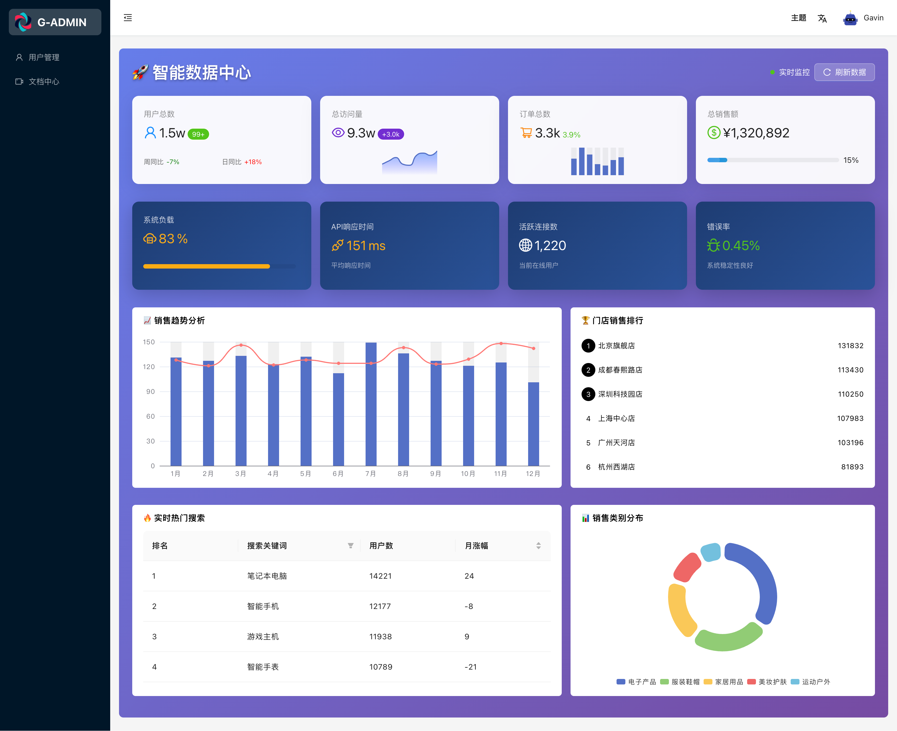
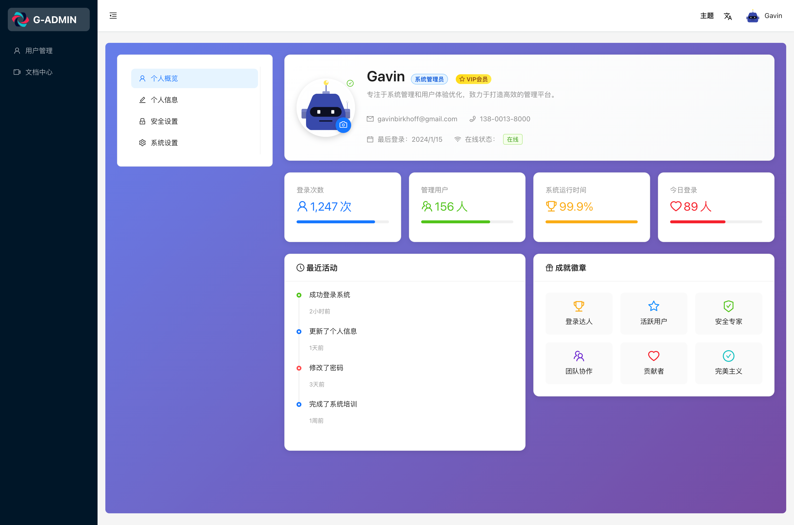

# React UMI Admin

🚀 基于 React 18 + UMI 4 + Ant Design 5 的现代化中后台管理系统模板

正在制作中...，敬请期待，点赞收藏不迷路。

匠人精神，用心雕琢每一个细节，架构部分会做到极致。（业务部分只是例子）

基于 react18，umi4，antd5 等的中后台管理模版，可以快速开展我们的业务功能。

特别说明，目前前后端一起开发，可能数据不对版，大家关注耐心等待。我要把前后做到极致的专业，无可挑剔。后面前端架构部分会切换 vite，业务部分不变。

## 🎯 适用场景

1. 快速开发中后台管理系统，不必要为技术选型和封装模块而浪费精力和时间，而且不需要其他业务代码。
2. 当很多功能我们需要自己实现，所以这套项目只实现架构部分和用户登陆鉴权。市面功能太多的项目反而不利于我们快速开发。（ 通常我们需要研究很久，还要删除大部分内容。 而且前后端两套项目很难解耦。后面我会实现更多的功能包括配套的后台系统，不会放到这个项目下，会给传送门。）

## 项目基建

### ✨ 特性

- [x] 约定式多环境构建和变量配置 [#33](https://github.com/gvray/react-umi-admin/issues/33) [#15](https://github.com/gvray/react-umi-admin/issues/15)
- [x] 主题定制和管理 [#24](https://github.com/gvray/react-umi-admin/issues/24)
- [x] 自定义布局 Layout 和菜单
- [x] 用户登录鉴权
- [x] 网络请求模块 基于 axios [#32](https://github.com/gvray/react-umi-admin/issues/32)
- [x] 请求方案 [#6](https://github.com/gvray/react-umi-admin/issues/6)
- [x] 系统异常处理
- [ ] 权限管理
- [x] UI 组件库 这里集成 antd5.x [#4](https://github.com/gvray/react-umi-admin/issues/4)
- [x] 全局状态管理 [#5](https://github.com/gvray/react-umi-admin/issues/5)
- [x] 国际化(多语言) 在`~src/locales`支持国际化定义 [#7](https://github.com/gvray/react-umi-admin/issues/7)
- [x] Mock 本地数据模拟 `~mock/` 里的文件都会自动加载 [#8](https://github.com/gvray/react-umi-admin/issues/8) MOCK_ENABLED 开启/关闭功能
- [ ] 路由 以及 keepalive
- [ ] 路由数据加载
- [x] 本地代理 [#34](https://github.com/gvray/react-umi-admin/issues/34)
- [x] 编码规范以及`git`提交验证 [#12](https://github.com/gvray/react-umi-admin/issues/12)
- [x] 工程代码调试 [#13](https://github.com/gvray/react-umi-admin/issues/13)
- [ ] 测试
- [x] 样式管理方案 [#17](https://github.com/gvray/react-umi-admin/issues/17)
- [x] Typescript 全面支持
- [ ] OpenApi
- [x] 微生成器 [#35](https://github.com/gvray/react-umi-admin/issues/35) Umi 中内置了众多微生成器，协助你在开发中快速地完成一些繁琐的工作。
- [ ] 开发插件
- [ ] MPA 模式
- [x] 打包构建优化
- [ ] 生产环境部署
- [ ] 微前端
- [ ] 站点统计

### 🚀 核心业务功能

- [x] 用户注册
- [x] 用户登录
- [x] 仪表盘
- [x] 个人中心
- [x] 用户管理
- [x] 角色管理
- [x] 权限管理
- [x] 资源管理
- [x] 部门管理
- [x] 岗位管理
- [x] 字典管理
- [x] 配置管理

## 🔧 开发环境

- **Node.js**: >= 16.0.0
- **包管理器**: PNPM (推荐)
- **编辑器**: VSCode (推荐)
- **浏览器**: Chrome >= 80

## 其他技术栈

- [vue-pinia-admin](https://github.com/gvray/vue-pinia-admin) 开发中
- react-vite-admin 开发中 未开放
- next-admin 开发中 未开放
- [nest-admin](https://github.com/gvray/nest-admin) 后端 开发中
- java-admin 后端 开发中 未开放

## 后台数据

后端 api 地址 [nest-admin](https://github.com/gvray/nest-admin) 开发中

当后端没有数据的时候我们可以自己`mock`数据

- 目前后台数据都在`~/mock`下，这里是基于 express 启动的本地 api 服务。
- 这样就可以很灵活的做好前端部分，然后灵活的对接一个后端服务。

注意：目前只提供了登陆和 user 模块的 mock 数据

## 启动项目

```bash
pnpm install

npm start
```

## 登陆页面

登陆路径：/login 登陆账号：admin@example/admin/13800138000 登陆密码：admin123


## 首页

路径：/



## 用户页面

路径：/user


## 个人中心

路径：/profile



## 打包分析

```bash
npm run analyze
```


## umijs 鸡肋功能

| 功能 | 鸡肋理由 | 替代建议 |
| --- | --- | --- |
| ✅ **access 权限模型** | 简单场景好用，但复杂权限结构（资源级、角色组合）扩展难，类型提示不友好，和 wrappers 冲突多 | 用自定义 hooks + 权限组件，如 `<Permission>` 或更细粒度的策略系统 |
| ✅ **wrappers（高阶组件配置路由）** | 把权限、布局用路由配置绑定，有侵入性且难调试，不如 React 中常规 HOC/useEffect 写法清晰 | 自定义 Layout 或页面内部逻辑判断更灵活 |
| ✅ **request 插件（封装的** `umi-request`**）** | 封装层太重、依赖旧版 fetch polyfill，灵活性差，不如 axios 或 useRequest、react-query 灵活 | 替换为 axios + 自定义 hooks，或直接用 SWR/react-query |
| ✅ **@/models 全局状态管理** | 适合老项目或约定式开发，但模型共享复杂，异步逻辑不如 Redux Toolkit、zustand 明确 | 中大型项目建议直接用 Zustand、Redux Toolkit |
| ✅ **locale 国际化插件** | 强耦合约定式目录、ts 类型提示差，多语言资源集中管理不便 | 推荐用 `i18next` 或 `vue-i18n/react-i18next` 自主控制 |
| ✅ **约定式目录结构（特别是** `page/document.tsx`**,** `layouts`**,** `app.ts`**）** | 项目复杂后耦合度高，逻辑分散在多个文件中，不易统一维护 | 转向配置式或者 module-based 结构（如 routes.ts + 全局 layout） |
| ✅ **微前端 qiankun 集成插件** | 一般项目微前端用不了，插件配置繁琐，调试体验不如手写集成 | 自己手写 qiankun 接入（很简单，3-5 个生命周期） |
| ✅ **链式插件系统（插件套插件）** | 插件机制很强但调试和定制化麻烦，业务团队二次封装成本高 | 只启用必须插件，其余功能裸写更透明 |
| ✅ **内置 DVA 支持** | DVA 学习成本高，异步和副作用处理陈旧，现代项目极少使用 | 推荐 Zustand、RTK、Recoil 等现代状态库 |

注意: @umijs/max，黑盒比较严重，后期项目修改扩展成本太大。
