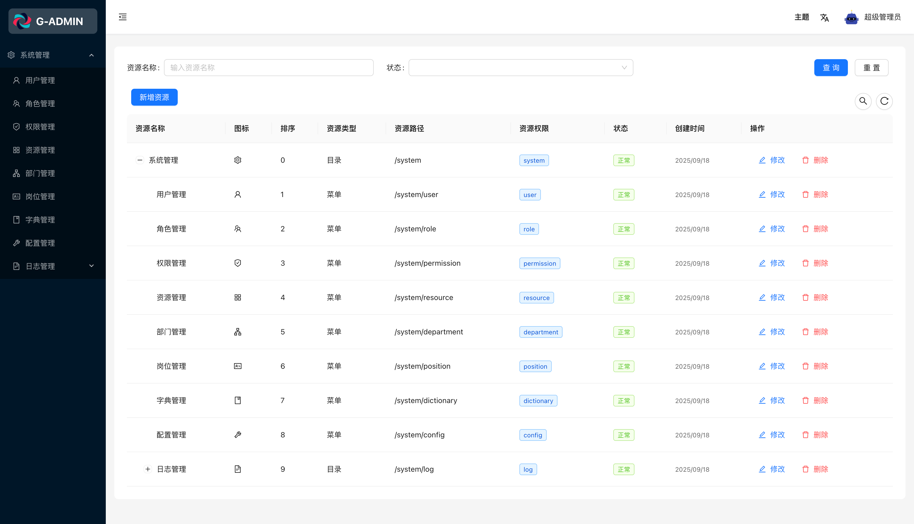

# React Umi Admin — 企业级 RBAC 权限管理系统 & 前端架构解决方案

<!-- keywords: react, umi, ant-design, rbac, admin, dashboard, permission, access-control -->

🦄 基于 React18 + Umi4 + Ant Design5 构建的现代化后台管理系统，专注于**前端架构与技术方案的极致实现**。系统提供完整的 RBAC 权限管理、全局状态管理、动态路由、布局定制、多语言支持、网络请求封装、Mock 数据模拟等核心能力，可直接作为企业级后台系统开发的通用框架。

- 作为多年一线前端开发者，我希望通过这个项目总结和沉淀自己的经验，为中后台项目提供一套高可维护、可扩展的前端架构。
- 项目不仅展示 RBAC 权限管理方案，也体现现代前端技术和最佳实践。

---

- 匠人精神：前端架构追求极致，注重可维护性与可复用性。
- 开发说明：前后端正在同步开发，部分数据仍在持续更新。
- 未来规划：前端架构将切换至 Vite，保持业务逻辑稳定与高性能表现。

⭐ 如果你认同我们的技术理念，欢迎 Star 支持。

## 🎯 适用场景

适用于希望快速构建中后台管理系统的团队与个人开发者。

本项目专注于前端架构设计与核心技术方案封装，帮助开发者在不重复造轮子的前提下，快速搭建高质量、可扩展的企业级后台系统。

## 🏗️ 项目基建

> 聚焦前端架构与工程体系，全面覆盖现代中后台系统的核心能力

### ⚙️ 架构特性

- [x] 约定式多环境构建和变量配置 [#33](https://github.com/gvray/react-umi-admin/issues/33) [#15](https://github.com/gvray/react-umi-admin/issues/15)
- [x] 主题定制和管理 [#24](https://github.com/gvray/react-umi-admin/issues/24)
- [x] 自定义布局 Layout 和菜单
- [x] 用户登录鉴权
- [x] 网络请求模块 基于 axios [#32](https://github.com/gvray/react-umi-admin/issues/32)
- [x] 请求方案 [#6](https://github.com/gvray/react-umi-admin/issues/6)
- [x] 系统异常处理
- [ ] 权限管理
- [x] UI 组件库 这里集成 antd5.x [#4](https://github.com/gvray/react-umi-admin/issues/4)
- [x] 全局状态管理 [#5](https://github.com/gvray/react-umi-admin/issues/5)
- [x] 国际化(多语言) 在`~src/locales`支持国际化定义 [#7](https://github.com/gvray/react-umi-admin/issues/7)
- [x] Mock 本地数据模拟 `~mock/` 里的文件都会自动加载 [#8](https://github.com/gvray/react-umi-admin/issues/8) MOCK_ENABLED 开启/关闭功能
- [ ] 路由 以及 keepalive
- [ ] 路由数据加载
- [x] 本地代理 [#34](https://github.com/gvray/react-umi-admin/issues/34)
- [x] 编码规范以及`git`提交验证 [#12](https://github.com/gvray/react-umi-admin/issues/12)
- [x] 工程代码调试 [#13](https://github.com/gvray/react-umi-admin/issues/13)
- [ ] 测试
- [x] 样式管理方案 [#17](https://github.com/gvray/react-umi-admin/issues/17)
- [x] Typescript 全面支持
- [ ] OpenApi
- [x] 微生成器 [#35](https://github.com/gvray/react-umi-admin/issues/35) Umi 中内置了众多微生成器，协助你在开发中快速地完成一些繁琐的工作。
- [ ] 开发插件
- [ ] MPA 模式
- [x] 打包构建优化
- [ ] 生产环境部署
- [ ] 微前端
- [ ] 站点统计

💡 技术提示：本项目摒弃了 Umi 黑盒插件复杂配置，采用自定义 hooks、现代状态管理（Zustand / Redux Toolkit）、灵活路由和独立布局方案，实现可扩展、高可维护的前端架构。

⚡ 技术深度：关于 Umi 的局限性与最佳实践，请参考 [UMI 限制分析](./UMI_LIMITATIONS.md)

### 🧩 核心功能模块

- [x] 用户注册
- [x] 用户登录
- [x] 仪表盘
- [x] 个人中心
- [x] 用户管理
- [x] 角色管理
- [x] 权限管理
- [x] 资源管理
- [x] 部门管理
- [x] 岗位管理
- [x] 字典管理
- [x] 配置管理

## 💻 开发环境

Node.js 20+ · pnpm · Cursor / VSCode · 现代主流浏览器

🧠 Tip: 建议使用 `.nvmrc` 文件统一 Node 版本，并在团队协作中启用 `corepack` 绑定 pnpm 版本。

## 🗄️ 后台数据

后端 API 地址：[nest-admin](https://github.com/gvray/nest-admin)（开发中）

当前项目支持**前端独立开发**，当后端数据尚未就绪时，可使用本地 Mock 数据：

- Mock 数据目录：`~/mock`，基于 Express 启动的本地 API 服务
- 可灵活替换或扩展接口，实现前端与后端的独立开发
- 目前仅提供 **登录模块** 和 **用户模块** 的 Mock 数据

> 💡 Tip: 使用 Mock 数据可以在前端架构和功能开发阶段保持高效，同时未来可无缝对接真实后端服务。

## 🚀 启动项目

```bash
# 安装依赖
pnpm install

# 启动开发环境（默认 dev，端口 9527）
pnpm start

# 或者分别启动不同环境。 这里数据是mock，能看到的页面有限，推荐 pnpm start:staging。
pnpm start:dev      # 开发环境，端口 9527
APP_API_URL=/api

pnpm start:staging  # 测试环境，端口 9528
APP_API_URL=http://localhost:8001

pnpm start:prod     # 生产环境，端口 9529
APP_API_URL=https://api.dev.example.com
```

## 🖥️ 页面展示

登陆路径：/login 登陆账号：admin@example/admin/13800138000 登陆密码：admin123


---

<table>
  <tr>
    <td></td>
    <td></td>
  </tr>
    <tr>
    <td></td>
    <td></td>
  </tr>
  <tr>
    <td></td>
    <td></td>
  </tr>
  <tr>
    <td></td>
    <td></td>
  </tr>
</table>

## 🧩 其他技术栈生态

- Vue 3 + Vite + Pinia 版本（[vue-pinia-admin](https://github.com/gvray/vue-pinia-admin)，🚧 开发中）
- React + Vite 版本（react-vite-admin，🚧 开发中）
- Next.js 版本（next-admin，🚧 开发中）
