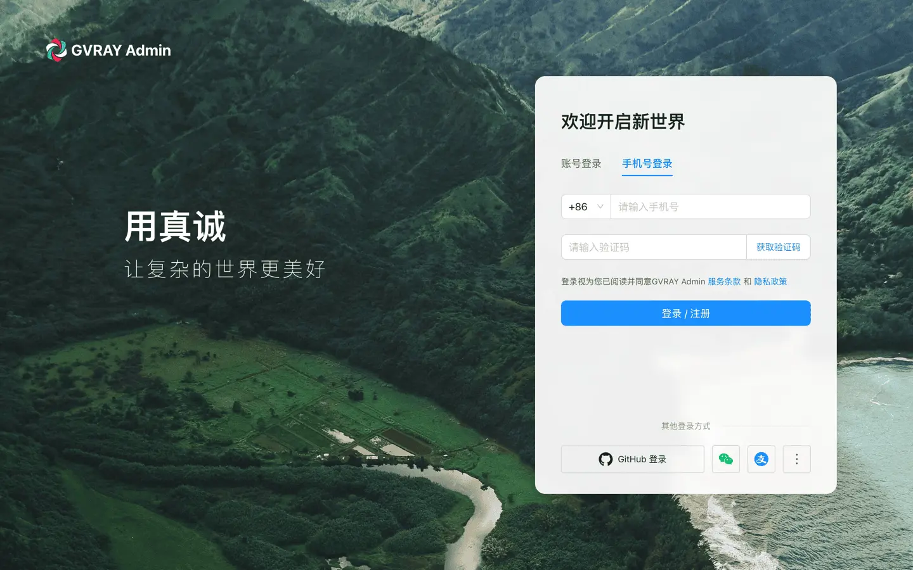

# Gvray Admin

🦄 基于 **React**、**Umi**、**Ant Design**、**TypeScript** 构建的企业级后台管理系统，专注于 **现代前端架构** 与 **RBAC 权限体系** 设计，提供动态路由、多主题、国际化、运行时配置、Mock、OpenAPI 等核心能力，可直接作为企业后台项目的 Starter Template。

<!--
keywords:
react,
react18,
umi,
umi4,
ant-design,
antd5,
typescript,
zustand,
axios,
react-intl,
rbac,
permission,
access-control,
dashboard,
admin,
admin-template,
starter-template,
boilerplate,
mock,
openapi,
i18n,
theme
-->

## 📸 项目预览

<p align="center">
  
  
  
</p>

## ✨ 核心能力

| 能力 | 描述 |
| --- | --- |
| 🔐 RBAC 权限管理 | 菜单、按钮、API 三层权限控制 |
| 🔑 双 Token 认证 | access + refresh 双 Token 管理，带过期缓冲策略 |
| 🧭 动态路由 | 基于权限自动生成路由与菜单 |
| 🎨 多主题 | 支持浅色、深色等主题切换 |
| 🌍 国际化 | 基于 React Intl 的多语言支持 |
| 📖 全局字典系统 | `DictionaryLabel` / `DictionarySelect` / `useDict` 后端字典一键映射 |
| 🗂️ 状态管理 | Zustand 轻量状态管理，支持持久化与 Immer |
| 🛡️ 全局错误边界 | ErrorBoundary 捕获渲染异常，显示降级 UI |
| 🌐 数据请求 | `@gvray/request` Axios 请求管线与统一错误处理 |
| ⚙️ Runtime Config | 运行时配置，无需重新构建即可调整部分配置 |
| 🎭 Mock | Mock 与真实接口无缝切换 |
| 📄 OpenAPI | 自动同步接口定义与 TypeScript 类型 |
| 🏗️ TablePro 增强表格 | 内置高级搜索、分页、刷新、useTablePro Hook |
| 🐳 工程化 | TypeScript、Docker、多环境配置 |

## 🎯 适用场景

适合作为以下项目的基础框架：

- 企业后台管理系统
- SaaS 管理平台
- RBAC 权限系统
- 中后台管理平台
- Admin Starter Template
- 前端架构实践项目

## 📖 文档导航

| 文档 | 说明 |
| --- | --- |
| [Roadmap](docs/roadmap.md) | 功能规划与开发进度 |
| [Architecture Documentation](docs/architecture.md) | 系统架构设计与实现 |
| [Developer Guide](docs/developer-guide.md) | 开发指南 |
| [Docker 部署指南](docs/docker.md) | Docker 化部署方案 |
| [UMI 限制分析](docs/umi-limitations.md) | Umi 最佳实践 |
| [Theme 规范](docs/theme-guidelines.md) | 主题与样式设计规范 |
| API 类型同步 | OpenAPI → TypeScript 自动生成 |
| [Contributing](docs/contributing.md) | 提交规范与贡献指南 |

## 🧩 核心功能模块

| 模块          | 功能                                             |
| ------------- | ------------------------------------------------ |
| 👤 身份与权限 | 登录认证、用户管理、角色管理、权限管理、菜单管理 |
| 🏢 组织架构   | 部门管理、岗位管理                               |
| ⚙️ 系统管理   | 字典管理、系统配置、通知公告                     |
| 📊 系统监控   | 服务监控、在线用户、缓存监控                     |
| 📝 日志审计   | 登录日志、操作日志                               |

## 🚀 快速开始

### 环境要求

- Node.js >= 20
- Corepack（Node.js 内置）

### 安装依赖

```bash
pnpm install
```

### 启动项目

```bash
# 默认开发环境（内置 Mock 数据）
pnpm start

# 开发环境（内置 Mock 数据）
pnpm start:dev

# 测试环境（连接 gvray-admin 后端）推荐
pnpm start:staging

# 生产环境
pnpm start:prod
```

### 测试账号

| 环境 | 账号 | 密码 |
| --- | --- | --- |
| Mock（`pnpm start` / `pnpm start:dev`） | `admin` | `123456` |
| Staging（`pnpm start:staging`） | 请参考后端初始化数据 | 请参考后端初始化数据 |

> 💡 推荐先启动 **gvray-admin** 后端，再使用 `staging` 环境体验完整功能。

更多配置请参考：

- `.env.dev`
- `.env.staging`
- `.env.prod`
- [Developer Guide](docs/developer-guide.md)

后端仓库：

👉 https://github.com/gvray/gvray-admin

## 🌱 项目生态

| 仓库 | 技术栈 |
| --- | --- |
| **[gvray-admin](https://github.com/gvray/gvray-admin)** | NestJS + Prisma |
| **[gvray-react](https://github.com/gvray/gvray-react)** | React + Umi |
| **[gvray-vite](https://github.com/gvray/gvray-vite)** | React + Vite |
| **[gvray-vue](https://github.com/gvray/gvray-vue)** | Vue3 + Vite + Element Plus |
| **[gvray-next](https://github.com/gvray/gvray-next)** | Next.js |

## ❤️ 支持项目

如果这个项目对你有所帮助，欢迎点一个 **⭐ Star**。

你的支持，是项目持续迭代和完善的最大动力。
